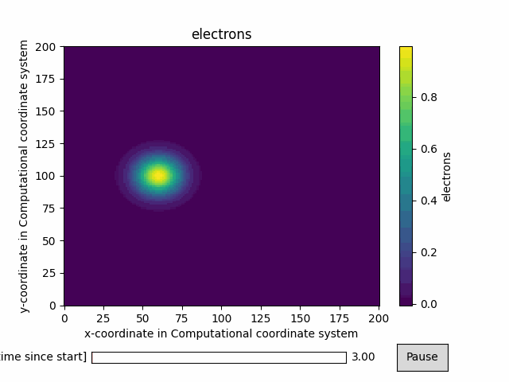
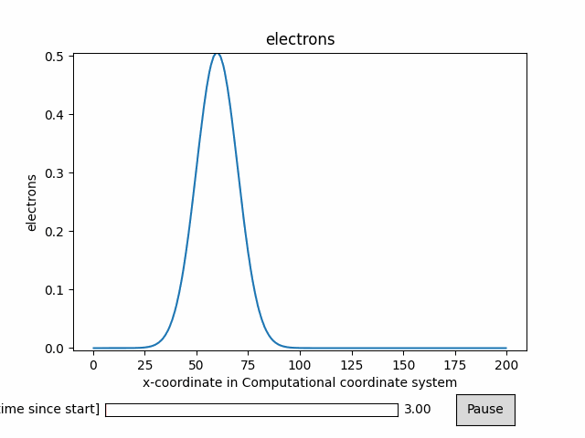

# xFELTOR
xFELTOR provides an interface for collecting the output data from a
[FELTOR](https://github.com/feltor-dev/feltor) simulation into an
[xarray](https://xarray.pydata.org/en/stable/index.html)
dataset. 

xFELTOR is inspired by [xBOUT](https://github.com/boutproject/xBOUT) and uses currently some of its plotting functionality.

## Installation

Dev install:
```
git clone https://github.com/uit-cosmo/xFELTOR.git
cd xfeltor
pip install -e .
```

### Loading your data

The function `open_feltordataset()` uses xarray & dask to collect FELTOR
data spread across multiple NetCDF files into one contiguous xarray
dataset.

The data can be loaded with

```python
ds = open_feltordataset("./run_dir*/*.nc")
```
xFELTOR stores all variables from the FELTOR input file as attributes (xarray.Dataset.attrs).
### Plotting Methods

In addition to the extensive functionalities provided by xarray, xFELTOR offers some usefull plotting methods. 

In order to plot the evolution of a 2D variable over time:
```python
ds["electrons"].feltor.animate2D(x="x", y="y")
```
 

For plotting a 1D variable over time:
```python
ds["electrons"].isel(y=100).feltor.animate1D(animate_over="time")
```
 

You can also plot multiple 1d and 2d variables over time:
```python
ds.feltor.animate_list(
    variables=[
        ds["electrons"],
        ds["ions"].isel(y=100),
        ds["potential"],
        ds["vorticity"],
    ]
)
```
